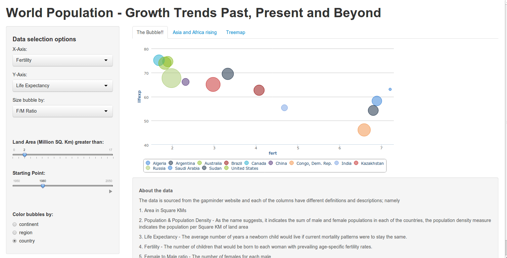
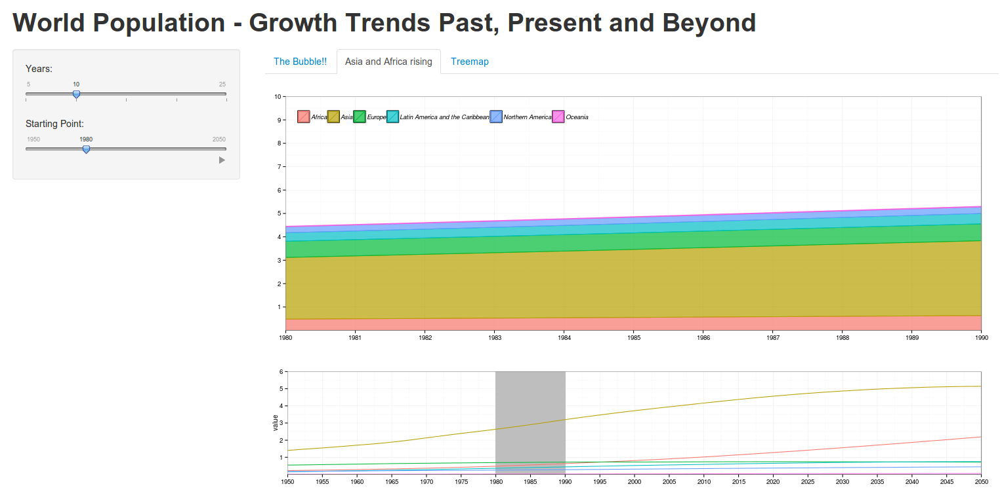
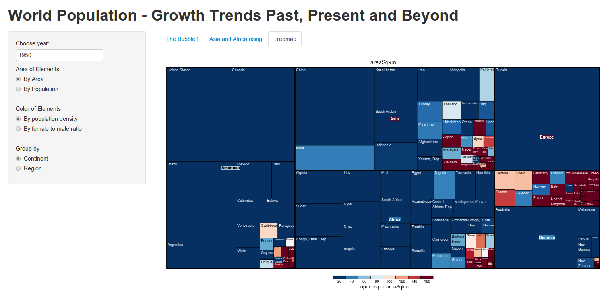
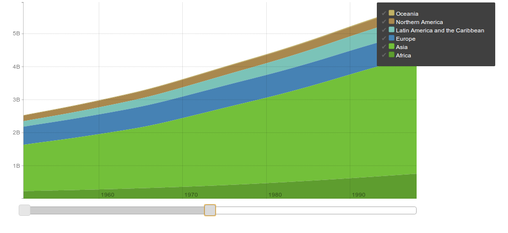

Final Project
==============================

| **Name**  | Manoj Venkatesh  |
|----------:|:-------------|
| **Email** | mvenkatesh@dons.usfca.edu |


## Setup & Instructions ##
The `Shiny` app needs the following packages to be installed to run.
 - `ggplo2`
 - `reshape`
 - `rCharts`
 - `treemap`
 
To run this code, please enter the following commands in R:
```
library(shiny)
shiny::runGitHub('msan622', 'manoj-v', subdir='final-project')
source_url("https://github.com/manoj-v/msan622/blob/master/final-project/rcharts_interactive_area.R")
```
## Discussion ##
I have tried to visualize world population projections till 2050, the data  is from the `Gapminder` website and processed further to bring it to a plottable format. Multiple such data sources have been combined to get a more wholistic view of how different continents/regions/countries demographies are changing with respect to life expectancy, per capita income and fertility. I have 3 visualizations in the shiny app and the 4th one which i created using the `Rickshaw` charts part of `rCharts` package failed to integrate into the shiny app. I have created a separate file for that visualization, where the user after running the R code will be able to interact with the app in a web browser. 

### Techniques ###
#### Technique 1 - Bubble Plot ####


For the first technique, i tried to replicate the gapminder world visualization, but with more data i.e projections till the year 2050. I wanted to explore how things might like with the projected data. A lot of data processing had to be done to reduce the data to contain information for 200 countries with data till 2050, namely 
 - Combining multiple csv files.
 - Imputing missing values.
 - Extracting region and continent names, cleaning up few of the country names.
 - Normalizing the data (removing uncommon countries in the data sources)
 
It is a highly interactive visualization, where the user can control the Year, the various axes, size of the bubbles to interact with the data. Also once the user decides on the interaction setup, the user can hover over the data points to see the actual values. The user can select and deselect bubbles by clicking on them. As the default view, i have set some of the filters already, say the size of the countries by area, coloring the bubbles by the continent they belong to and choosing a preset for the year. One very interesting thing which stood out for me in this plot was how in 'Russia', women outnumber men by a large percentage whereas in majority of the other countries it is the other way around. Although i was suspicious of these numbers, i did crosscheck with wikipedia to confirm this and this turned out to be true and most of it is attributed to drug and alcohol abuse in Russia. There are many such outliers which stand out in this plot.

#### Technique 2 - Time Series Plot ####


The time series plot is also an interactive plot similar to a class example. This chart has 2 sub plots displayed, one displays the overview of the population growth over the time duration 1950 to 2050 represented by a line chart. The other plot is a stacked area plot which is more like a zoomed in version of the growth trend. As the slider movies animates, it steps through a moving window and displays the trend for that time duration. The user can choose the moving window size, animate the trend growth.

I had planned to use this in a previous assignment but chose not to, but i find that this is an interesting representation of the overall growth trends grouped by the continent. I did not get the effect i was hoping for or i imagined it to be, but it looks more like an increase in volume of the areas. When viewing both the plots, the lower 'line' plot indicates the growth trends of the various continents and gives a different kind of information and the other plot above it looks a lot smoother over time.

#### Technique 3 - Treemaps ####


I wanted to try something different with this dataset, so i decided on using a treemap from the `treemap` package. Although treemap initself is not meant to be a interactive plot, i have given the user the choice to decide on the year, plotting the treemap based on population or area, grouping by either a region or the continent itself and also coloring the area by population density or female to male ratio. 

Through this plot i aim to help the user visualize how the distribution of people is spread out, the user can easily figure out how large the americas and the europe continents are, but the overall population density is way less compared to the asian and african continent. The user has the chance to look at how the female to male ratio is spread out all over the world. In most of the asian countries and some european nations, it is predicted that women will outnumber the men. If the treemap is generated by grouping the regions, one can clearly see where such regions are going to exist in future. It is mostly in major parts of asia and unsurprisingly Europe and parts of south america.


#### Technique 4 - Rickshaw charts (Time Series) ####


This is not part of the shiny app, it is included as a separate file in the folder. This would not integrate very well with the existing shiny app so i had to create a standalone visualization which is still interactive and has few but very good interactive features. When viewed first time, the plot looks static, but the slider, the legend and the tooltips make it an interesting plot to view. One would argue that this is similar to the time series plot in technique 2, but i would say this improves on that plot by a great deal and providing very useful interactivity. 

The user can use the slider to zoom in and zoom out of the entire time frame. Just by moving the sliders, the users can get a zoom in effect and also using the tick marks on the legend, the user can choose the continents wants to view. Some interesting insights through this plot, europe is projected to have almost the same population it has right now and the continents of africa combined would hold close to 70% of the worlds people. One can also see higher rate of increase in population concentration 


### Interactivity ###
Since the dataset is temporal, i have used sliders extensively as a tool for panning and zooming. In the first 2 plots, the user can use the sliders to control the year(s) of interest, window width and indirectly as a panning technique. With the use of rCharts in the first plot in the shiny app and the standalone R code for rickshaw charts. 

With the use of numeric inputs, radio buttons and checkboxes (in legends), the user would be able to filter and interact with the data more efficiently. I feel using interactivity in terms of filtering and sizing the treemaps enchances the plot by a great deal. In case of the rCharts plots - bubble plot and rickshaw stacked area plots, the inbuilt interactivity with minor customizations are very useful, the user can choose to display only relevant data helping temporal multivariate data. 

### Prototype Feedback ###
I received valuable feedback from the prototype feedback exercise. I was able to incorporate most of the review comments into my final project. Even though i had only a couple of prototypes running, both were relatively new techniques using packages which were not used previously. Feedback about the treemap was most helpful, i had initially plotted the treemaps on scales such as gdp, life expectancy, etc which in a treemap would induce a high lie factor, as the sum of all these metrics do not represent the whole. So it was suggested by most of the reviewers that i use a metric which would represent the sum of the areas as a whole. Based on this, i finalized on using only the population and land area as the only 2 options i would use for sizing the areas of the treemap. And this change has made the treemap more meaningful and insightful. 

I received feedback about the bubbles animating for every year chosen, i tried my best to change this behaviour with my limited javascript knowledge, i could not spend enough time to address these quirks of rCharts. 

### Issues & Frustrations ###
Some of the issues when issuing a package such as `rCharts` is lack of documentation on how to use the package itself and its integration issues in a shiny app, there was not enough documentation when it came to shiny and rCharts and with whatever resources available about it was not adequate, so i had to create a new separate file for just that visualization. Similarly trying to control the bubble animation in the bubble plot is also a major challenge which i could not figure how to. 

Another major time consuming part is the data processing, i really would not call it an issue, but more of a challenge, trying to combine multiple files, extracting continent, region names. Trying to impute values which sometimes required manual effort i.e. opening the file and fiddling with the values. If i had more data, i would be able to include even indicators such as unemployment, median age group, etc. 