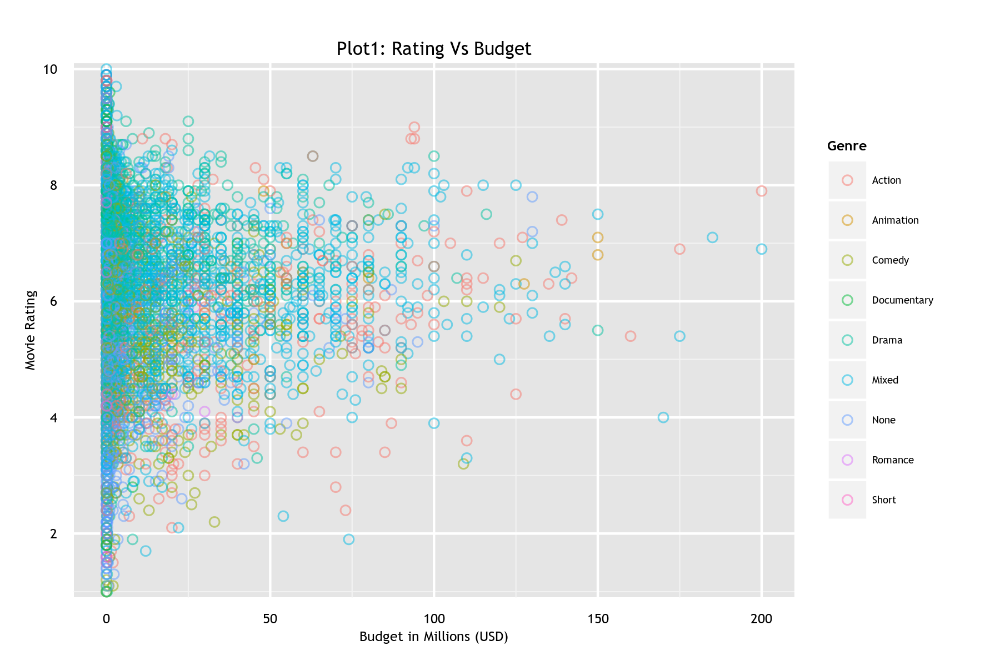

Homework 1: Basic Charts
==============================

Setup
------------------------------

This assignment will use the `movies` dataset in the `ggplot2` package and the `EuStockMarkets` dataset. 
Use the following code to load the datasets:

```
library(ggplot2) 
data(movies) 
data(EuStockMarkets)
```

Then, perform the following transformations:

- Filter out any rows that have a `budget` value less than or equal to 0 or an 'NA' in the `movies` dataset. 
  ```
  idx <- which(movies$budget <=0 | is.na(movies$budget))
  movies <- movies[-idx,]
  ```

- Add a `genre` column to the `movies` dataset as follows:
  ```
  genre <- rep(NA, nrow(movies))
  count <- rowSums(movies[, 18:24])
  genre[which(count > 1)] = "Mixed"
  genre[which(count < 1)] = "None"
  genre[which(count == 1 & movies$Action == 1)] = "Action"
  genre[which(count == 1 & movies$Animation == 1)] = "Animation"
  genre[which(count == 1 & movies$Comedy == 1)] = "Comedy"
  genre[which(count == 1 & movies$Drama == 1)] = "Drama"
  genre[which(count == 1 & movies$Documentary == 1)] = "Documentary"
  genre[which(count == 1 & movies$Romance == 1)] = "Romance"
  genre[which(count == 1 & movies$Short == 1)] = "Short"

  # Add the Genre column to the movies2 dataframe
  movies$Genre <- genre

  ```

- Transform the `EuStockMarkets` dataset to a time series as follows:
  ```
  eu <- transform(data.frame(EuStockMarkets), time = time(EuStockMarkets))
  ```

Visualizations & Discussion
------------------------------

- **Plot 1: Scatterplot.** 

Below is the scatter plot for the movies dataset. With the `budget` as x-axis and the `rating` as the y-axis, i felt it is better to have a color scheme to distinguish the different genres of movies, hence ordered the colors to the data points based on the `Genre` they are categorized as. 



Although the visual is not vastly improved but at the least there is some demarcation between the different genre of movies. The x-axis has been scaled and expressed in millions of USD and a legend added as an aid for identification. Since the number of reviews for *Mixed* are way too many in number, they overlap most of the other genres.


- **Plot 2: Bar Chart.** 


- **Plot 3: Small Multiples.** 


- **Plot 4: Multi-Line Chart.** 

