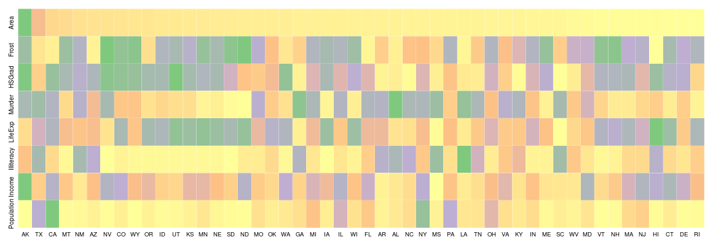
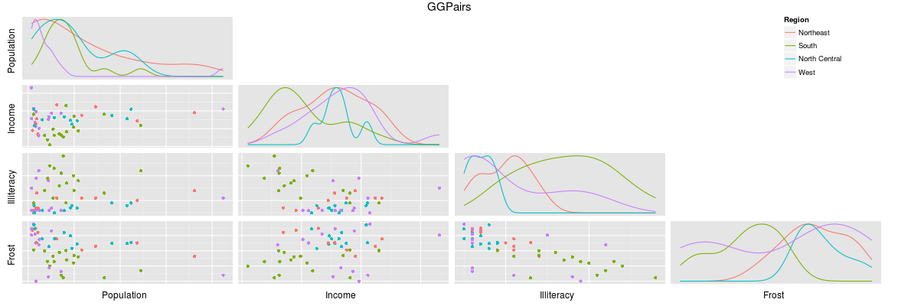
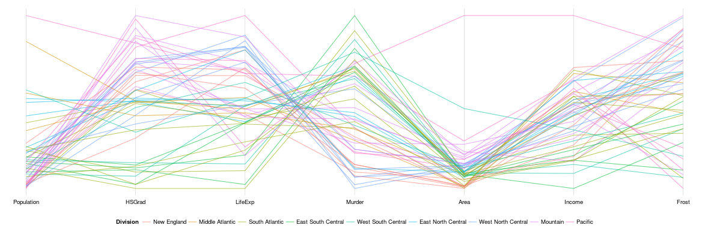
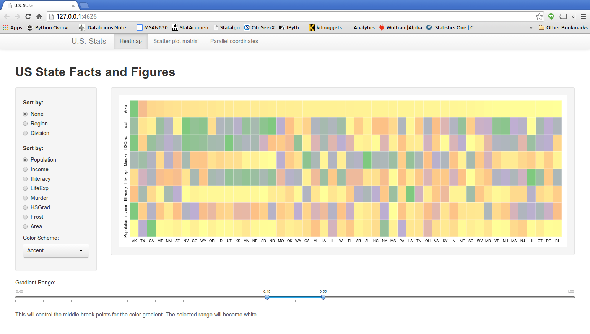
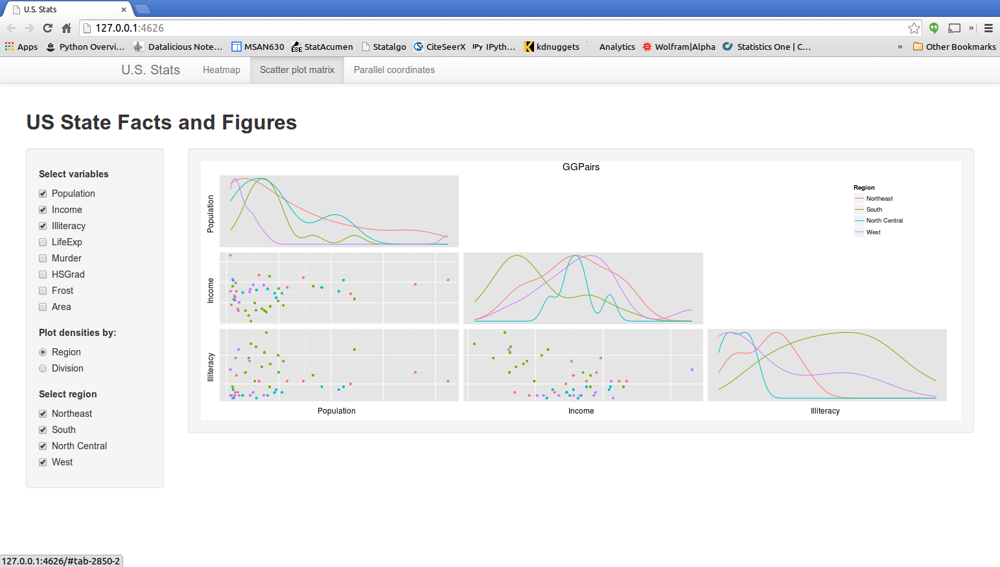
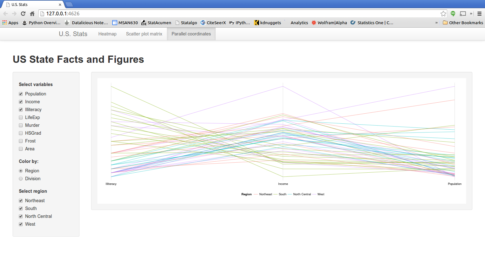

Homework [3]:  Multivariate Data Visualization
==============================

| **Name**  | MANOJ VENKATESH  |
|----------:|:-------------|
| **Email** | mvenkatesh@dons.usfca.edu |

## Instructions ##

The following packages must be installed prior to running this code:

- `ggplot2`
- `shiny`
- `scales`

To run this code, please enter the following commands in R:

```
library(shiny)
shiny::runGitHub('msan622', 'manoj-v', subdir='homework3')
```
This will start the `shiny` app. See below for details on how to interact with the visualization.


## Discussion ##

### Technique 1: Heatmap ###



Objective of this heatmap is to visualize all the 8 numerical components in the data, i decided not to remove any of the columns as i felt the heatmap gives a holistic view of the data. I chose to use heatmap instead of a bubbleplot as i could visualize more information, the relative comparisions amongst the different variables are evident because of the extreme data points. All the states associated with higher values for a particular attribute are colored differently. 

### Technique 2: Scatterplot matrix ###



I decided to use the scatterplot matrix as a means of visualizing the correlations between the different variables and also the densities of each of the variables can easily be visualized. If one looks at the densities of each of the variables, one could distinguish the differences between the different regions. 

  For example, if one looks at the above plot for the population, income and literacy, we can see that the 'south' region (in green) is low interms of population and income but the overall literacy levels are pretty constant in all of the states.

### Technique 3: Parallel Coordinates Plot ###



Parallel coordinates plot is an interesting tool, it aids in visualizing a high dimensional data in a low dimensional space. But too many dimensions would not very favorable. In this instance it is very useful in understand a variety of information in one single plot. 


### Interactivity ###

I combined `fluidPage` along with `navbarPage` and `tabPanel` to get a `Shiny` app which would resize as per the screen resolutions of the user. Using the `fluidRow` and `column` options i was able to get a clean and consistent layout across all the three visualizations.  
The main page contains 3 tabs, one for the current heatmap, one for scatter plot matrix and also for a parallel coordinates plot. The user can click on the respective tabs to navigate to the respective plots. In each of these pages, there are various controls for sorting the data in differet orders, different sort levels, different color schemes and also controls for selecting a partial list of variables to be visualized.


  The first tab contains the heatmap, the user can sort the data at different levels, by default the data is displayed after sorting first by the area(top row) and then by population (bottom row). On the heatmap, one can see that as different order settings are chosen, heatmap transitions smoothly. Color scheme is chosen such a way that the highest values in each of the categories are highlighted completely differently (for example, in the default view, area of Alaska (AK) is highlighted in green color and the next largest state Texas (TX) is colored differently) and intensity of the colors indicate how different or similar other states are. 
  

  The second tab contains the scatter plot matrix. The user can select the variables to be visualized in the scatter plot and also choose to plot the densities either by region or by division to which the state belongs to. The user can also visualize by selecting only a subset of the data based on the region the state belongs to.
  

  Similar to the second tab, the controls are kept consistent, the user can choose which variables are to be plotted and also can subset based on the region and also visualize the data based on either the region or its division. 