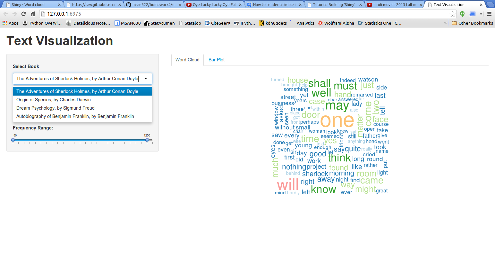
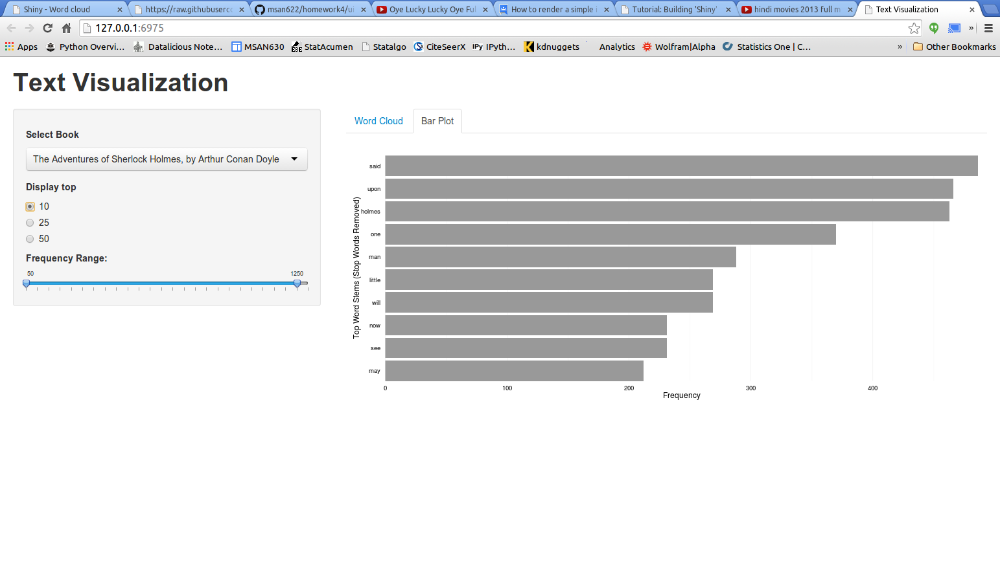
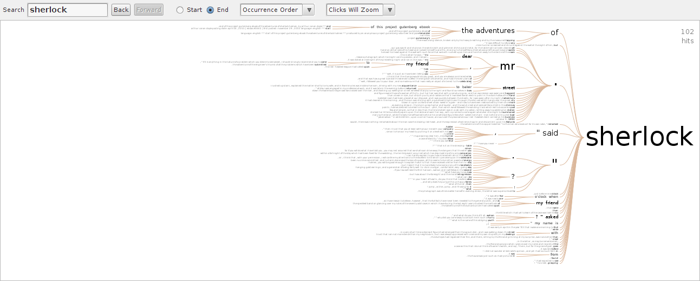

Homework 4: TEXT VISUALIZATION
==============================

| **Name**  | MANOJ VENKATESH  |
|----------:|:-------------|
| **Email** | mvenkatesh@dons.usfca.edu |

The following packages must be installed prior to running this code:

- `ggplot2`
- `shiny`
- `tm`
- `wordcloud`

To run this code, please enter the following commands in R:

```
library(shiny)
shiny::runGitHub('msan622', 'manoj-v', subdir='homework4')
```

This will start the `shiny` app. See below for details on how to interact with the visualization.

## Discussion ##

I chose to visualize 3 different texts from project gutenberg, i concentrated mainly on creating a interactive visualization. In order to munge the data, I used the tm package in R to remove stopwords, set the words to lowercase, and then remove some undesirable words that the stopwords list missed and saved all the respective dataframes and the same is being read in the server file.



### Technique 1: Word Cloud | Technique 2: Bar Plot

I created this plot using the worcloud package in R. I decided to color the plot because the color matches a frequency, and this makes it clearer the difference between the sizes of the words. The slider allows the user to input the frequency range of the words they want to include the in the cloud and also a radio button is provided to choose between the number of words to be displayed in the wordcloud. I have used the same input controls for barplot too.



### Technique 3: Word Tree



I used the manyeyes website to create a wordtree and in the image i have visualized only of the texts i.e. Adventures of Sherlock Holmes.
The link to this visualization is below:

http://manyeyes.com/software/analytics/manyeyes/visualizations/sherlockholmes