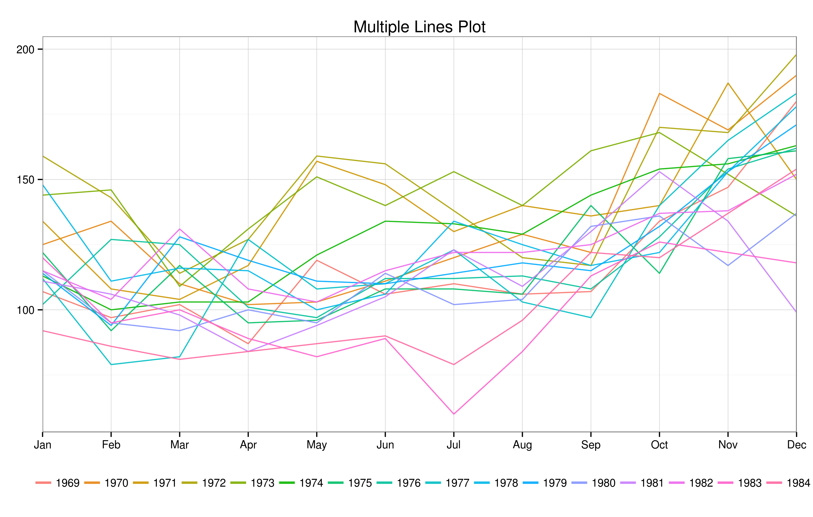
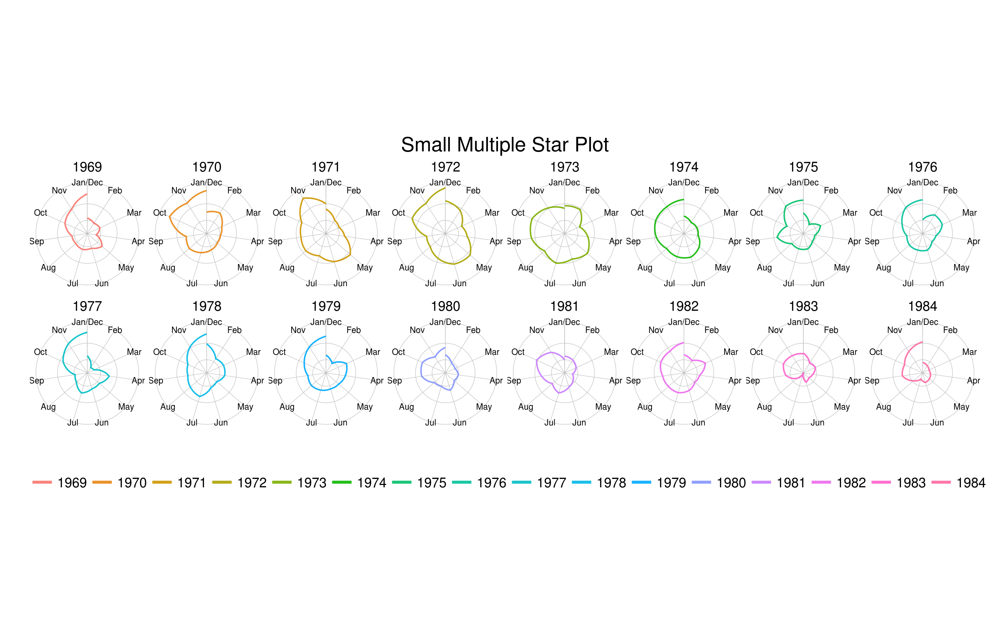
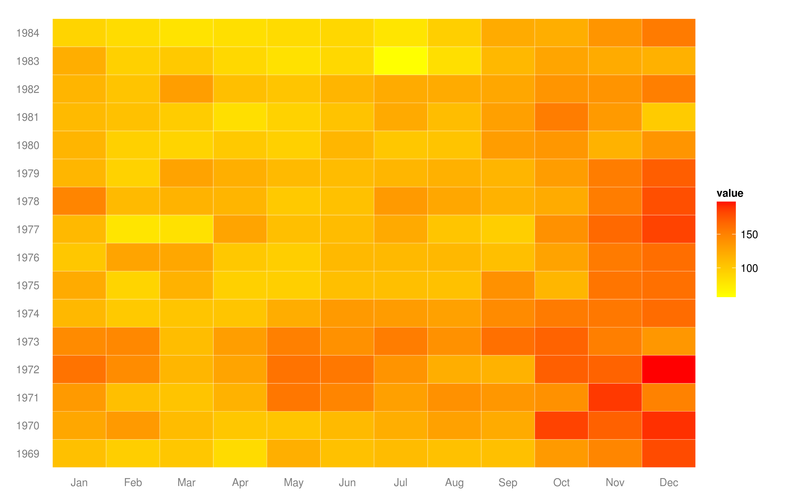
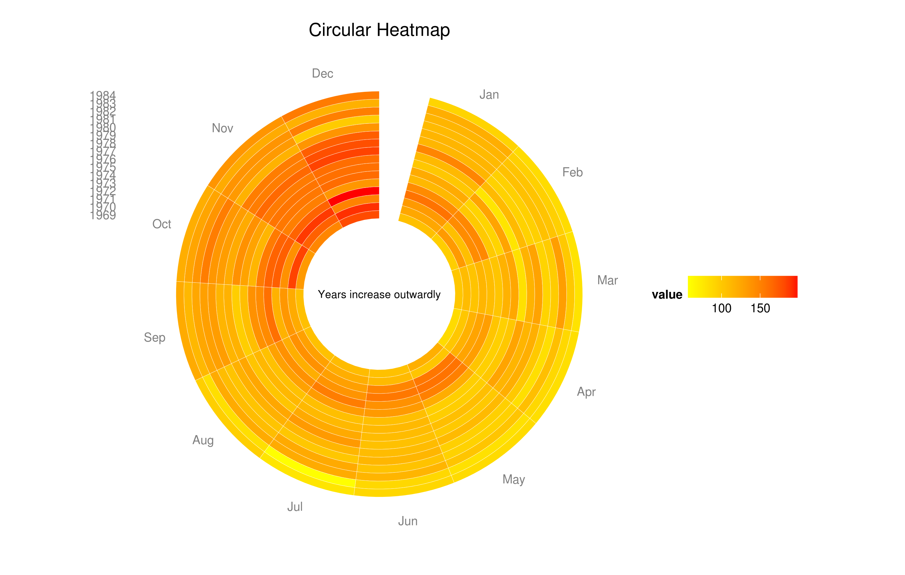

Homework 5: Temporal
==============================

| **Name**  | Manoj Venkatesh |
|----------:|:-------------|
| **Email** | mvenkatesh@dons.usfca.edu |

## Instructions ##
The following packages are used in generating the plots:

- `ggplot2`
- `reshape2`

The source code is available at `https://github.com/manoj-v/msan622/tree/master/homework5/HW5.R`

```
# Extract time for grouping later
# From time extract Months and Calendar Year
times <- time(Seatbelts)
Years <- factor(floor(times), ordered = TRUE)
Months <- factor(month.abb[cycle(times)],levels = month.abb,ordered = TRUE)

# BUILD THE DATA FRAME

myData <- data.frame(Seatbelts)
myData <- data.frame(
  times = as.numeric(times), 
  Years = Years, 
  Months = Months, 
  myData)
```
## Discussion ##
  To maintain consistency i have used the basic theme `theme_bw()` in the first 2 plots and have maintained the same color schemes for plot 3 and plot 4. I have tweaked some of the functions which were provided in the `pretty.r` file to suit the requirements. The tweaks being location of the legend, removal of ticks, etc. I have tried to visualize the same metric/variable in all of the plots

### TECHNIQUE 1 - MULTILINE CHART ##
LIE FACTOR: LOW | DATA DENSITY: HIGH | DATA-INK RATIO: MEDIUM

  I have created a multiple lines plot to illustrate the number of drivers killed in road accidents every year between '1969' and '1984'. Overall in general it is seen that there are more deaths during the end of the year i.e in the months of November and December.
  LIE FACTOR: 

### TECHNIQUE 2 - MULTIPLE STAR PLOT ##

LIE FACTOR: LOW | DATA DENSITY: HIGH | DATA-INK RATIO: MEDIUM
  To improve on the observation of increased deaths in November and December, i applied the `coord_flip()` function on the multilines plot to get the multiple star plot. Through this plot, one can see that in most of the years the circles (irregular) are larger in size, whereas post the introduction of the seatbelt law in `31 Jan 1983` there is a significant descrease in the number of deaths and hence the corresponding circles for 1983 and 1984 are significantly smaller in size. 

### TECHNIQUE 3 - HEAT MAP ##

LIE FACTOR: MEDIUM | DATA DENSITY: LOW | DATA-INK RATIO: HIGH
  Another visual for the same data variables is the heatmap, i created the heatmap reusing most of the demo code with very few customizations. 
  
### TECHNIQUE 4 - CIRCULAR HEATMAP ##
LIE FACTOR: LOW | DATA DENSITY: LOW | DATA-INK RATIO: HIGH

  To improve on the previous heatmap, i tried the polar coordinate representation of the heatmap, this came out similar to the example circular heatmap. I added an annotation in the middle of the circular heatmap to display text saying the years increase outwardly and the area of the concentric circle doesnot indicate the size of anything. Because of the annotation, there was a split in the circle which somehow worked very well in my case as the dates are not spiral i.e not continous so one gets a clear demarcation between the years instead of appearing as a continous segment.

#### THINGS I TRIED BUT DID NOT WORK ##
 - I had initially planned to display the relation between the `PetrolPrice` and `kms`, but after looking at the data and the correlations, i could not see any trend and also there was very little change in the `PetrolPrice` over these years.
 - I had also thought of showing the trend in deaths and also a trend in percentage of `front` and `rear` injuries, but decided against it as the plot did not seem that impressive and trying to extract a smooth trend for deaths was challenging. 