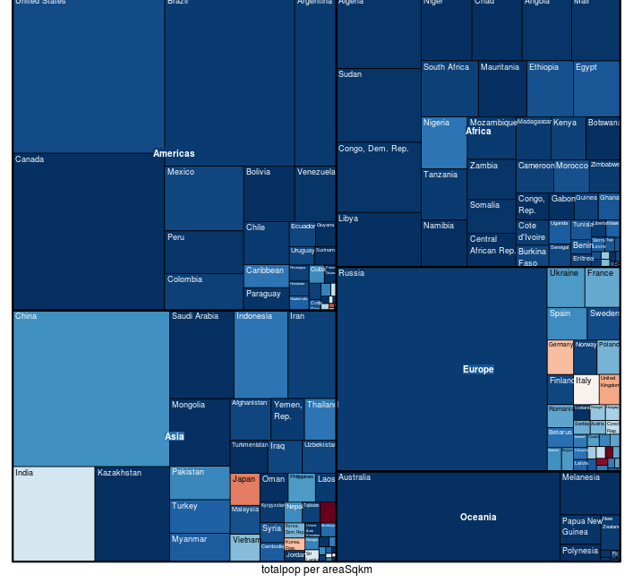
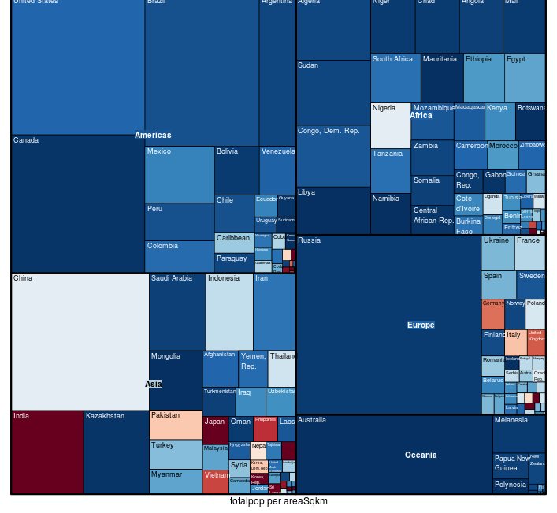
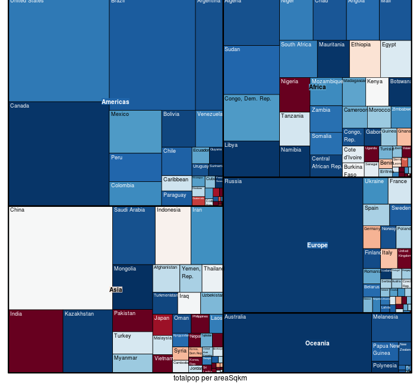

Project: Prototype 
==============================

| **Name**  | MANOJ VENKATESH |
|----------:|:-------------|
| **Email** | mvenkatesh@dons.usfca.edu |

## Discussion ##

I am trying to replicate the gapminder visualization where 
 - I plan to display a couple of metrics on both the axis and use the population and other measures to size the bubbles 
 - Use the time/region/continent as the criteria to filter out ranges for years.
 - Either use time buckets or a continuous range as inputs

### STATIC VISUALIZATION - TREEMAP
I chose to do a treemap to display the relative areas and the population density in each of the countries
 - They can be grouped by either region or continent and 
 - The metrics such as total population, male population, female population, area, population density can be used to plot and color the areas.

### CHANGE OVER THE YEARS





#### SAMPLE UI
```
library(shiny)
shiny::runGitHub('msan622', 'manoj-v', subdir='project-prototype')
```

#### DATA SOURCES
 - Gapminder website
 - Google Search

### The code for processing the data
 - `dataprep.R`
