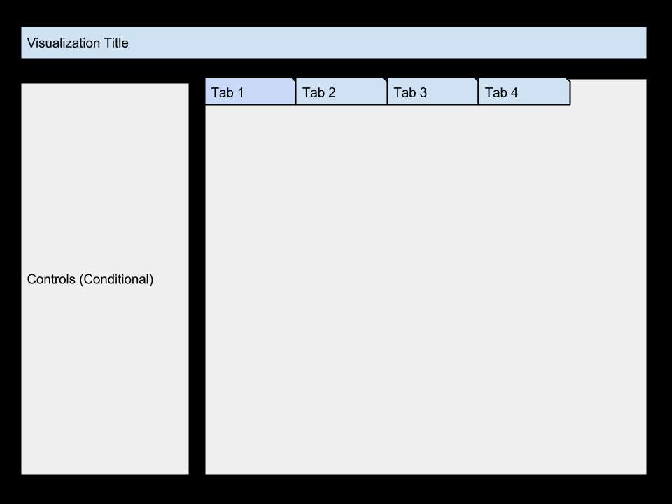

Project: Sketch
==============================

| **Name**  | MANOJ VENKATESH |
|----------:|:-------------|
| **Email** | mvenkatesh@dons.usfca.edu |

### PROJECT LAYOUT 

## Discussion ##
I plan to use the world population dataset from https://docs.google.com/spreadsheet/ccc?key=0AonYZs4MzlZbcGhOdG0zTG1EWkVOb3FVbVRpa0Y5REE#gid=10, it contains data from the past about populations of countries for every year till date and also projections till 2100.

### Techniques & Interaction 
I plan to have different tabs but have common controls such that all the plots are in sync, i may have some controls on the plot to give additional interactivity with each of the plots. But at the high level, below are the techniques i plan to use in each of the tabs.
 - Tab1: Time Series based bubble Plot (Area by Area or population/area or bubbles based on country or continent) 
 - Tab2: Map based input - Time Series based on selection of Country or Continent (Filtering/Brushing/Sorting)
 - Tab3: Heatmap with options for different sort orders and all data columns and also a slider probably to change the time to generate.
 - Tab4: Table which gets dynamically generated based on the inputs from the sliders
